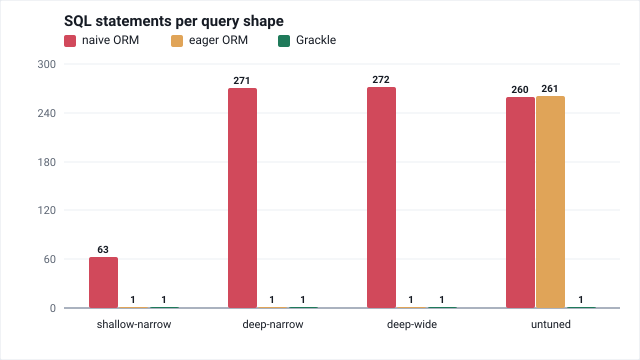
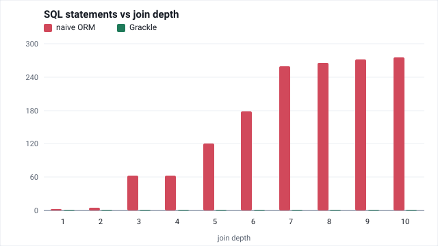
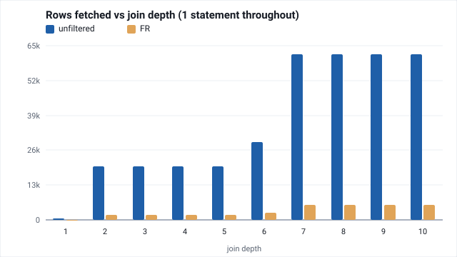
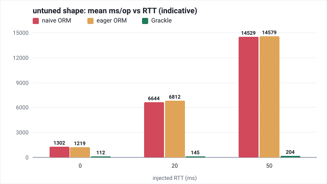
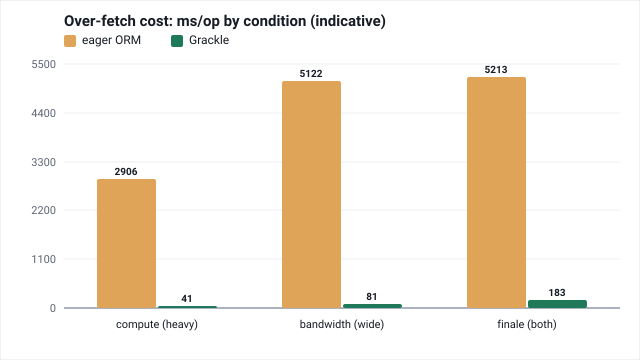

# SQL join-depth benchmarks

Benchmarks how Grackle's compile+execute time scales as GraphQL query nesting
walks deeper down a real 11-table join chain (AdventureWorks-for-Postgres: `CountryRegion
→ StateProvince → Address → BusinessEntityAddress → Person → Customer → SalesOrderHeader
→ SalesOrderDetail → Product → ProductSubcategory → ProductCategory`), against a
dedicated Postgres instance seeded via Docker.

The charts below are generated from `charts/chart-data.json` (`sbt benchmarksSql/generateCharts`)
and verified in CI (`benchmarksSql/checkCharts`). Interactive charts and a public results site
remain future work.

## Topology

The benchmark JVM does not talk to Postgres directly. A Toxiproxy container owns host
port 5433 and forwards to `benchmark-postgres:5432` over the Docker network:

    benchmark JVM  --(host :5433)-->  toxiproxy  --(docker network)-->  benchmark-postgres :5432
                         admin API on host :8474

`benchmark-postgres` no longer publishes a host port of its own, so there is no way to
accidentally bypass the proxy and measure an un-delayed connection. Every JDBC URL in
this repo is still `jdbc:postgresql://localhost:5433/benchmark` and needed no change.

The proxy is created at container start from `testdata/benchmark-pg/toxiproxy.json`
(mounted read-only), not via the admin API, so it is already present for consumers that
never touch the API — the test suites, `AdventureWorksServer`, and the other JMH classes.
It starts with no toxics, i.e. zero added latency, so anything that does not deliberately
inject latency behaves as it did before *modulo* the proxy's own hop cost: every consumer
of port 5433 now pays one extra userspace round trip per TCP interaction, whether or not
it ever calls the admin API. That cost has not been quantified but is expected to be
sub-percent; see the measurement caveats below for what it means for older figures.

`sbt benchPgUp` starts both services and waits for both to be healthy; `sbt benchPgStop`
stops both. `sbt benchPgUp` will NOT clear a toxic left behind by an interrupted latency
run, since `docker compose up -d --wait` is a no-op against an already-healthy container
and toxics live only in the proxy's memory, not in the mounted config file. Check for one
with:

    curl -s http://localhost:8474/proxies/benchmark-postgres/toxics

An empty `[]` means the proxy is clean. If it is not, clear it with:

    docker compose --profile benchmarks restart toxiproxy

`SqlJoinDepthBenchmark` and `RawVsGrackleBenchmark` also guard against this themselves —
each clears toxics as the first step of its own `@Setup(Level.Trial)` — but the check
above is the fastest way to confirm the proxy's state directly, e.g. before trusting a
number that looks off.

`benchmarksSql` is a standalone sbt project, not aggregated into the root build (see
`build.sbt`): a plain `sbt test` / `sbt compile` at the repo root will not touch it,
and `benchmark-postgres` is behind the `benchmarks` Docker Compose profile so a plain
`docker compose up` will not build or start it either. Use the `benchmarksSql`-scoped
sbt tasks below instead.

## Running

    sbt benchPgUp                      # starts benchmark-postgres; first run takes
                                        # several minutes to build the image and load
                                        # the AdventureWorks dataset
    sbt "benchmarksSql/Jmh/run -rf json -rff results.json"

`SqlJoinDepthBenchmark` carries explicit `@Fork(3)`, `@Warmup(iterations = 5)`, and
`@Measurement(iterations = 10)` annotations, so a bare run above already uses settings
sized for trustworthy results: 3 forks (a single fork would hide JIT profile pollution)
x (5 warmup + 10 measurement) iterations x 5 `depth` params. Those annotations set
iteration *counts* only; JMH's default iteration *time* of 10s still applies on top, so
the bare run above costs roughly 3 x 15 x 10s x 5 = 2,250s of measurement alone, plus 15
JVM fork launches — **approximately 40 minutes end to end**. Add `-prof gc` for
allocation-per-operation figures, which are near-deterministic and so remain meaningful
on a machine too noisy for trustworthy wall-clock numbers. For a quick sanity check
while iterating on the benchmark itself, override the annotations with explicit flags,
e.g. `sbt "benchmarksSql/Jmh/run -f 1 -wi 1 -i 1 -r 1s -w 1s SqlJoinDepthBenchmark"`.
See the doc comment on `SqlJoinDepthBenchmark` for more.

Results land in `benchmarks-sql/results.json` (JMH resolves the `-rff` path relative
to the module's base directory, not the repo root), in JMH's built-in JSON format,
one entry per `depth` param (2, 4, 6, 8, 10), with `SampleTime` percentiles.

    sbt benchPgStop                    # stop the container when done

## Testing

    sbt benchmarksSql/test

Runs `JoinChainSuite` (query-generator unit tests), `AdventureWorksMappingSuite`
(mapping/execution smoke tests), and `SqlQueryCountsSuite` (pins the query-count
invariants below — exactly 1 query per depth, plus a weaker N+1 bound as a safety net)
against `benchmark-postgres`, which is started automatically as part of the test setup.
This is scoped to the `benchmarksSql` project deliberately — a plain, unscoped `sbt
test` does not run these tests.

## Query counts (the headline metric)

    sbt "benchmarksSql/runMain grackle.benchmarks.sql.SqlQueryCounts"

Runs outside JMH entirely — it just wires `AdventureWorksMapping` up to
`DoobieMonitor.statsMonitor` and counts how many SQL statements Grackle issues per
`depth`, using the unpooled `BenchmarkDb.transactor` since nothing here is timed. It
measures two datasets at every depth 1-10:

- **Unfiltered** (`JoinChain.queryForDepthUnfiltered`, `SqlQueryCounts.countsForUnfiltered`):
  `countryRegions` with no `code` argument, so Grackle's `SelectElaborator` leaves the
  root unfiltered and the query fans out across all 238 country regions — up to
  **61,898 rows** at depth 8-10. This is the stronger claim: nothing about the query
  shape was chosen to flatter the result, since it is simply the same query with the
  root filter omitted entirely.
- **Filtered** (`JoinChain.queryForDepth`, `SqlQueryCounts.countsFor`): the original,
  narrower measurement rooted at a single country region (default `FR`, 5,677 rows at
  depth 8-10), kept alongside the unfiltered one as a smaller, easier-to-eyeball
  cross-check.

**Result: exactly 1 SQL query per depth, for both datasets, regardless of nesting depth
or row count.** Both tables print to stdout and are written to
`benchmarks-sql/query-counts.json` (gitignored, like `results.json`) under top-level
`"unfiltered"` and `"filtered"` keys — the unfiltered entry is labelled by an explicit
`"scope"` field, the filtered entry by its `"rootCode"`. It also writes
`benchmarks-sql/query-sql.txt` (gitignored too, diagnostic-only, not a published
metric, and covering the filtered dataset only): the normalized text of every SQL
statement Grackle emitted at each depth, one labelled section per depth — see
`SqlQueryCounts.renderSql`. Run it from the repo root as shown above: unlike
`Jmh / run`, plain `Compile / run` (what `runMain` uses) is not forked with the
module's base directory as its working directory, so the output path is spelled out
relative to the repo root rather than relying on sbt to resolve it.

Also unlike `Jmh / run`, `runMain` has no `benchPgUp` dependency wired in `build.sbt` —
run `sbt benchPgUp` first, or the harness will fail to connect.

The sibling `benchmarks-orm` module measures the same four query shapes through two
Hibernate/JPA arms — a naive lazy-loading arm and an eager arm (blanket `@BatchSize`
plus a per-shape `@EntityGraph`). Their statement counts make Grackle's single query
concrete by contrast:

<!-- CHART:statements-per-shape START -->

<!-- CHART:statements-per-shape END -->

The naive arm issues 63-272 statements per shape — classic N+1. The eager arm matches
Grackle's single statement on the three shapes its entity graphs were tuned for, then
collapses to 261 on `untuned`, the shape nobody tuned for. Grackle issues **1 statement
for every shape**, tuned or not, by construction. The eager arm's good numbers are
per-shape and have to be re-earned for each new query; in GraphQL, where the client
chooses the shape, "the shape nobody tuned for" is the normal case.

Grackle's count is not just low but flat in depth — nesting another level onto the query
never adds a statement — while the naive arm's climbs with every level, the shape of N+1
(the naive figures are a representative snapshot; their counts jitter a little run to run):

<!-- CHART:statements-by-depth START -->

<!-- CHART:statements-by-depth END -->

The `rows` column reports the total rows Grackle's SQL fetched at each depth, and in
both datasets it is monotonic non-decreasing in `depth`, then flat once the chain
reaches `SalesOrderDetail`: filtered climbs to 5,677 rows at depth 7 and holds 5,677
through depth 10; unfiltered climbs to 61,898 at depth 7 and holds it through depth 10.
`query-sql.txt` (filtered only) settles the mechanism for the smaller dataset: every
join down through depth 7 (to `SalesOrderDetail`) is a `LEFT JOIN`, so the depth-7 query
returns one row per FR line item (5,558) *plus* one null-padded row for every upstream
chain that never reaches an order — 78 FR state provinces with no address, 40 addresses
with no person, and 1 person with no customer (78+40+1 = 119; 5,558+119 = 5,677, both
confirmed by running the captured depth-7 SQL directly against the fixture). Depths 8-10
add the `production.product`, `productsubcategory` and `productcategory` joins, each a
genuine `INNER JOIN` — but Grackle nests every one of them inside a
`LEFT JOIN LATERAL (…)` subquery hung off the outer chain (see the `..._nested` derived
tables in `query-sql.txt`), so the `INNER JOIN` filters only *within* that subquery and
can never eliminate a row from the outer `LEFT JOIN` chain. The 119 null-padded rows
therefore survive at every depth and the count holds at 5,677 rather than dropping. This
is the typelevel/grackle#888 fix ("don't drop rows for a non-null field under a nullable
parent") at work: before it, the depth-8 `INNER JOIN` flattened into the main chain and
eliminated all 119 (their `salesorderdetail`, and so `productid`, is `NULL`, and `NULL`
never satisfies an inner join's equality predicate), dipping the count to 5,558. (The
`..._nested` derived-table aliases are schema-qualified names folded to bare identifiers
by typelevel/grackle#342, without which Postgres rejects the dotted alias.) The
unfiltered dataset is generated by the identical query shape (same joins, same
`LEFT`/`INNER`/`LATERAL` placement, just without the root filter), so the same mechanism
holds its count flat at 61,898. Either way, this has nothing to do with query count,
which stays at 1 throughout in both datasets (see above).

That single statement covers an arbitrary amount of data. The rows it fetches climb with
depth and then plateau once the chain reaches `SalesOrderDetail` at depth 7 — while the
statement count above never moves off 1:

<!-- CHART:rows-by-depth START -->

<!-- CHART:rows-by-depth END -->

The unfiltered root (all country regions) reaches 61,898 rows at the plateau; the
single-region `FR` root reaches 5,677, the same curve at roughly a tenth the scale. Both
are fetched by one SQL statement at every depth.

Query counts are fully deterministic: no JIT warmup, no GC, no scheduling noise, so a
single run needs no repetition and is exactly reproducible. That determinism is what
makes them the headline number for demonstrating N+1 immunity — the depth→time curve
below is useful for comparing *shape*, but query counts are the number that settles
the argument outright, independent of machine noise.

## Measurement caveats

Numbers from this benchmark are useful for comparing the *shape* of the depth→time
curve, but are not a clean measurement of Grackle's own cost in isolation:

- Connection setup is deliberately excluded from every timed sample: `@Setup(Level.Trial)`
  allocates a pooled `HikariTransactor` once per trial (max pool size 4, see
  `BenchmarkDb.transactorResource`) and `@TearDown` releases it, so TCP connect + auth —
  a significant source of non-Grackle variance — never runs inside the measured region.
  `BenchmarkDb.transactor` still exposes an unpooled `Transactor.fromDriverManager`; the
  query-count harness (below) and the test suite both use it, since neither times
  anything, but the benchmark itself always goes through the pooled transactor.
- Postgres's buffer cache remains external state that JMH itself has no way to reset
  between `depth` settings, but `@Setup(Level.Trial)` deliberately prewarms it
  (`BenchmarkDb.prewarm`, backed by `pg_prewarm`) across all 11 chain tables before every
  trial, so each `depth` value starts from a hot cache rather than an arbitrary one.
  `pg_prewarm(regclass)` only warms a table's heap — the chain tables' heaps total ~36MB
  of the ~42MB grand total, against the default 128MB `shared_buffers`; the remaining
  ~6MB of indexes are not prewarmed by this call and instead get warmed incidentally
  during warmup iterations.
- The query is rooted at a single country region (default `FR`) rather than spanning
  all of them, to keep the per-operation payload small. This benchmark uses
  `Mode.SampleTime`, where each iteration is time-bounded (10s by default), so wall-clock
  cost is `forks x iterations x iterationTime` regardless of per-operation cost — a
  smaller payload buys no extra forks or iterations. What it does buy is more *samples*:
  phase 1's depth-10 cost was ~354ms/op, so a 10s iteration collected only ~28 samples,
  far too few to support the p99 this README reports elsewhere. Cutting the payload
  roughly 10x yields hundreds of samples per iteration, which is what makes the
  percentile numbers meaningful. The depth→time curve should not be read as covering the
  dataset's full result-set size.
- Figures measured before phase 3 (the Toxiproxy topology described above) were taken
  without a proxy hop in the path at all, not merely with zero added latency. They are
  not directly comparable to a post-phase-3 zero-latency figure to better than whatever
  that hop costs, which has not been quantified.

## Rebuilding after a seed-script or Dockerfile change

`testdata/benchmark-pg/install.sh` (which seeds the AdventureWorks data and, as of this
phase, also creates the `pg_prewarm` extension) only runs on a fresh, uninitialized
PGDATA. `docker compose up` neither rebuilds a `build:`-based service when its
Dockerfile changes nor re-runs initdb, and the seeded data lives in an anonymous volume
that outlives both container recreation and image rebuilds. So **anyone who ran an
earlier phase of this benchmark and then pulls a later one** — not just after editing
the Dockerfile — can end up with a stale volume whose seed script never ran the newer
steps. The concrete symptom of this phase's addition specifically is `@Setup` failing
with `function pg_prewarm(character varying) does not exist`. Fresh clones are
unaffected — this only bites existing checkouts with an already-seeded volume, so don't
do the rebuild dance unless you're actually upgrading one or hit that error.

Force a clean rebuild:

    docker compose --profile benchmarks down -v benchmark-postgres
    docker compose --profile benchmarks build benchmark-postgres

then `sbt benchPgUp` as usual.

## Latency sweep (phase 3)

Query counts prove the N+1 gap exists; injected round-trip time is what shows what it
costs. On a local Docker network the RTT to Postgres is near zero, so the naive ORM arm's
~260 extra statements cost only a few hundred milliseconds — in production, where the
database is across a network, that same statement count is the whole story.

<!-- CHART:untuned-ms-vs-rtt START -->

<!-- CHART:untuned-ms-vs-rtt END -->

*Indicative preview only.* Unlike every other chart here, these numbers are **not**
test-validated or reproducible: they come from a quick `-f1 -wi2 -i3` run with wide
confidence intervals and live in `charts/chart-data-timing.json`, kept separate from the
DB-validated `chart-data.json`. Read them as the shape of the gap, not authoritative figures. A
publishable sweep would refresh them. Even so the story is clear: at 50 ms injected RTT the eager
arm's `untuned` shape — the one its entity graphs do not cover — runs roughly 70x Grackle's,
while Grackle stays flat. The N+1 penalty is a round-trip penalty.

`OrmVsGrackleBenchmark` (in the `benchmarksOrm` module) sweeps a `latencyMs` param over
0, 5, 20, and 50 alongside its existing three arms and four shapes, giving 48
combinations in a single run:

    sbt "benchmarksOrm/Jmh/run -rf json -rff results.json OrmVsGrackleBenchmark"

**The trailing class filter is not optional.** `benchmarksOrm` depends on `benchmarksSql`,
so JMH discovers every benchmark on the combined classpath; without a filter it also runs
`SqlJoinDepthBenchmark` and `RawVsGrackleBenchmark`, which carry `@Fork(3)` and 10s
iterations and roughly double the wall-clock time.

Every level, including 0, goes through Toxiproxy, so the baseline carries the proxy's own
hop cost too and is directly comparable with the delayed levels. The toxic is applied per
trial, before the pooled transactor and `EntityManagerFactory` are built, so connection
establishment pays the injected RTT as well; it is cleared in trial teardown.

All three arms run inside a transaction — the ORM arms via `OrmVsGrackleBenchmark`'s own
`inTransaction` helper, the Grackle arm via doobie's `transact`. This matters more than it
sounds: a transaction costs one extra round trip per invocation — `COMMIT` alone, since
pgjdbc folds `BEGIN` into the first statement's flush — and an earlier sweep ran the ORM
arms in autocommit while the Grackle arm was transactional. That handed the ORM arms a
one-round-trip advantage per invocation, which is decisive on the single-statement tuned
shapes and invisible on the N+1 ones — enough to flip which arm wins at 50ms. Making the
arms symmetric moved the eager arm's slope from 0.92-1.02 to 1.94-2.07 on the three tuned
shapes (and 263.2 to 264.3 on `untuned`), putting it level with the Grackle arm's ~2. Running one arm transactional and the other not is the one configuration
that cannot be defended, and `@Transactional(readOnly = true)` is standard on Spring read
endpoints anyway, which is the practice the eager arm already mirrors.

That RTT is split across a pair of directional toxics — a 20ms level is a 10ms upstream
toxic plus a 10ms downstream one — because real latency accrues in both directions. Odd
values split unevenly (5ms becomes 2 + 3) so the pair always sums to exactly the level.
Jitter is fixed at 0: deterministic latency keeps run-to-run comparison clean.

This class carries reduced JMH settings (`@Fork(1)`, 2 warmup + 5 measurement iterations
at 5s each) rather than the `@Fork(3)`/5/10-at-10s used elsewhere in this repo. The
matrix is four times larger than phase 2's, and the naive arm at depth under a 50ms RTT
spends roughly 13.5s per invocation on network round-trips alone — a single iteration
cannot even complete in 5s there. Estimate 40-50 minutes for a bare run: 7 iterations x
5s = 35s per combination for every combination whose op fits inside an iteration (all 16
Grackle combos, 12 of 16 eager combos), plus the handful of overruns — the naive arm's
deep shapes and the untuned eager shape at 50ms (~13.5s/invocation, so ~95s) and at 20ms
(~38s) — totals roughly 32 minutes of iteration time, plus 48 fork startups with pool
creation, an 11-statement prewarm, and Hibernate EMF boot on top of that, another 5-8
minutes. Treat this as an estimate, not a promise — it has not been measured end to end.
The effect being measured is large enough that this trade is cheap; for a
publishable-tier run, override on the command line, e.g. `-f 3 -wi 5 -i 10 -r 10s -w
10s`.

For the deep shapes at `latencyMs=50`, a 5s iteration completes roughly one invocation,
so a trial yields only about 5 measurement samples. `Mode.SampleTime` still emits
p99/p100 columns into `results.json` for those combinations regardless — read Score/mean
only there, not the percentile columns; see the measurement caveats above for the same
point made about phase 1's depth-10 figures.

To reproduce one point by hand, or to explore a level not in the sweep:

    sbt "benchmarksOrm/Jmh/run -p latencyMs=20 -p shapeName=deep-narrow OrmVsGrackleBenchmark"

Query counts are unaffected by any of this and need no re-measurement: latency cannot
change how many statements are issued, only what each one costs.

## Over-fetching: the column-level cost

Statement count is one axis; the *width* of each statement is another. An ORM materializes
whole **entities** — every mapped column of every row it loads — because the object needs all
its fields. Grackle compiles the GraphQL selection set directly into the SQL projection, so a
column is fetched only if the query asks for it or it is needed as a join key. On the
`deep-narrow` shape (which projects just `countryRegionCode` and one terminal `category.name`),
Grackle's SQL selects **12 columns**; the tuned eager arm's selects **32** — every scalar of
every entity in the chain, including `firstName`, `lastName`, `city`, `territoryId`, `totalDue`
and the rest that nobody requested. Both fetch it in one statement, so this cost is invisible in
the query counts above.

Reducing columns is really reducing **work per row**, which has two flavours — bytes on the wire
and compute to produce the value. On this benchmark's real columns (all small, on a LAN) neither
is measurable, so `testdata/benchmark-pg/20-heavy-column.sql` adds two exaggerated columns to a
`person.person_heavy` view, read as ordinary columns by both mappings (a view, not a Hibernate
`@Formula` — Grackle has no equivalent, so that would be an unfair comparison):

- `heavy` — an `IMMUTABLE` function that is expensive to **compute** (tiny result). PostgreSQL
  evaluates it only for statements that actually project it (verified with `EXPLAIN`: it is
  pruned from the plan otherwise), so Grackle never pays it unless asked; the ORM's whole-entity
  fetch runs it once per row.
- `wide` — ~2KB of text per row: cheap to compute, but **bytes** on the wire.

These columns are reached only through a dedicated `people` root (Grackle) and three purpose-built
Hibernate entities over the `person_heavy` view — `PersonComputeEntity` (maps `heavy`),
`PersonBytesEntity` (maps `wide`), `PersonBothEntity` (both) — that no other benchmark uses, so the
statement and latency benchmarks above never touch these columns. Hibernate selects exactly an
entity's mapped columns, so each panel over-fetches **one** thing: `grackle.benchmarks.orm.OverfetchTiming`
fetches every Person row with Grackle always projecting only `firstName`, while the ORM loads whichever
entity the panel names:

<!-- CHART:overfetch-cost START -->

<!-- CHART:overfetch-cost END -->

- **Compute** — over-fetch `heavy` only, full bandwidth: the ORM pays `heavy_fn` per row — ~2.9s
  against Grackle's ~40ms. Pure CPU, so it survives a fully cached database.
- **Bandwidth** — over-fetch `wide` only, throttled to 8 MB/s: the ORM ships the extra ~40 MB of 2KB
  text — ~5.1s against Grackle's ~80ms. Pure bytes. (A *nested* query would be worse still: a wide
  column high in the chain is repeated across every descendant row in the flattened result.)
- **Finale** — over-fetch both, 50 ms RTT *and* 8 MB/s: everything at once — ~5.2s against Grackle's
  ~0.2s.

These figures are **indicative**, not validated: quick medians from `OverfetchTiming` (not a JMH
benchmark), and they live in `charts/chart-data-timing.json`, separate from the DB-validated
`chart-data.json`. The point is not the exact milliseconds but that column selection is a real
cost axis Grackle avoids by construction — one the query counts and the latency sweep never see.
